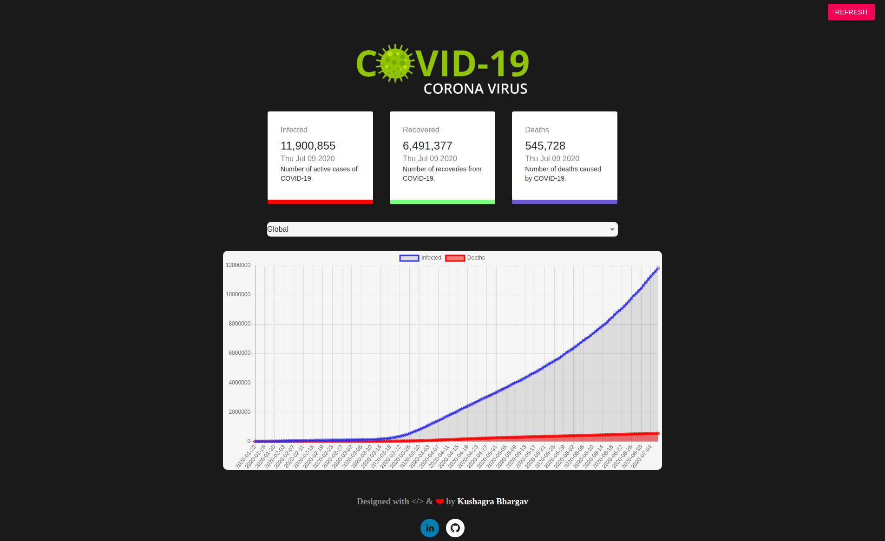

# COVID-19 Tracker
  

A web app to represent the data of COVID-19 epidemic build with React, Chart.JS and Material UI.

## Tech Stack

- HTML5, CSS3, Javascript, ReactJS, React Hooks, Chart.JS, Material UI
- API used: https://covid19.mathdro.id/api

## Screenshot of the Web App

Setup:
- Fork and clone this repository
- Run `npm i && npm start`

